# PennyOS Local Duplex Voice Implementation Plan

**Status:** Draft implementation plan
**Date:** 2026-07-26
**Authority:** Proposed execution contract for this feature only. It does not override `README.md`, `CODEBASE.md`, `ARCHITECTURE.md`, `docs/README.md`, privacy/security law, or release gates.
**Current product tier:** TTS for completed replies; no consumer microphone, VAD, or STT path.
**Target:** A packaged, local, privacy-visible Penny voice conversation path with explicit microphone control, Silero VAD, Whisper-family STT, streamed Penny chat, incremental TTS, safe interruption, and preserved Penny memory/tool/personality behavior.

> Planning is not product progress. Creating or approving this document does not mean PennyOS has microphone input, VAD, STT, streaming speech, duplex conversation, or packaged microphone proof.

## 1. Objective

Build the next PennyOS voice milestone as a sequence of independently provable slices:

1. explicit push-to-talk capture;
2. local transcription through the existing Speaches boundary;
3. transcript review and normal Penny chat submission;
4. incremental TTS from Penny's existing streamed reply;
5. deterministic cancellation and barge-in;
6. opt-in VAD-driven turn detection;
7. privacy-safe hands-free controls and expressive avatar states;
8. real local-runtime and packaged-consumer acceptance.

The completed experience should feel like talking to Penny, not like connecting a generic speech chatbot to Penny's window. Every transcribed turn must enter the same `/api/penny/chat?stream=1` path as typed input so the existing prompt, memory, tools, model routing, telemetry, and reply guards remain authoritative.

## 2. Read-first authority and preservation rules

Every implementation agent must read these before editing:

- `README.md`
- `CODEBASE.md`
- `ARCHITECTURE.md`
- `docs/README.md`
- `PRIVACY.md`
- `SECURITY.md`
- `docs/penny-public/pennyos-user-guide.md`
- `docs/release-checklist.md`
- this plan
- the active slice's listed owners and tests

Before every slice:

```powershell
git rev-parse --show-toplevel
git status --short --branch
git diff --name-only
```

Resolve the authoritative root with `git rev-parse --show-toplevel`; do not hard-code a maintainer-specific home-directory path.

Protected state observed when this plan was written:

- pre-existing edits in `lib/penny-voice-cadence.js`
- pre-existing edits in `penny-voice/runtime/penny-chat-directives.md`
- pre-existing edits in `penny-voice/runtime/penny-operational-blend.md`
- pre-existing edits in `test/penny-prompt-builders.test.js`
- pre-existing edits in `test/penny-voice-cadence.test.js`
- pre-existing untracked `outputs/`
- local model state and running service state are user-owned

Do not revert, reformat, stage, or absorb those changes. Do not start, stop, unload, reload, download, or swap an LM Studio, llama.cpp, Speaches, Docker, or embedding model without explicit user opt-in. Fixture tests and mocked providers are the default until a live-proof slice explicitly authorizes runtime work.

## 3. What the compared projects add

### 3.1 Earlier QCXINT post

The earlier post presents the right high-level local cascade: Silero VAD, Whisper, a local LLM, and local TTS under one VRAM budget. The saved video supports the visible concept of a voice/avatar interface, but it does not prove the implementation, latency, hot swapping, or a live-rendered avatar. Its strongest lesson for Penny is to publish measured end-to-end latency and resource receipts, not merely a polished recording.

### 3.2 Alice

Alice is more relevant than the earlier post as a voice-assistant UX reference. Source inspection at public `main` commit `3b055d5791ffa1ae2222352818125c673ea9c769` confirms:

- VAD-driven voice recognition;
- whisper.cpp STT and Piper TTS;
- interruptible speech and streaming cancellation;
- microphone toggles and hotkeys;
- optional post-transcription wake-word matching;
- local memory, tools, and MCP;
- packaged desktop installers.

Adopt the state visibility, explicit controls, sentence-level TTS queue, cancellation controllers, and packaged proof ideas. Treat Alice's barge-in and wake-word claims cautiously: cancellation does not clearly preserve the interrupting utterance as the next turn, and its “wake word” is substring matching after the utterance has already been recorded and transcribed. Do not adopt silent local-to-cloud fallback, fake placeholder audio, broad local-server exposure, blanket media permission, plaintext credential storage, or its product shape wholesale. Penny already has a deeper product-specific memory/tool/personality system, and Alice's custom avatars are pre-rendered video loops rather than a reason to replace Penny's sprite identity.

### 3.3 Project AIRI

AIRI is more useful as an architecture and expression reference than as a direct feature checklist. Source inspection at commit `ce65bcd7f5b8a4e445f2169218d580941554288f` found a single voice-input session owner, speech intents with independent cancellation, ordered TTS playback, capability-driven providers, and animation systems that consume rather than own conversation state. Its official engineering notes also break voice into small, reusable event stages:

- VAD;
- VAD + ASR;
- VAD + ASR + LLM;
- VAD + ASR + LLM + TTS.

That decomposition is the right model for Penny's slices. AIRI also demonstrates why listening, transcribing, thinking, speaking, and interrupted states should drive visible character/UI behavior.

Its cautions matter just as much: current desktop voice deliberately stops input during TTS and resumes after an echo cooldown, so it is half-duplex; browser-local Whisper settings remain visibly WIP; cancellation may discard stale GPU work without stopping inference; and README-native CUDA/Metal claims were not corroborated in the inspected source. Its plugin host can default-grant requested permissions, and analytics is not local-only by default. Penny should borrow AIRI's session/cancellation/capability boundaries without copying those completion, permission, or privacy assumptions. AIRI's broad Live2D/VRM, game, Discord, Telegram, provider, and WebGPU ambitions remain out of scope for this milestone.

### 3.4 Adopt, defer, reject

| Candidate | Decision | PennyOS use |
| --- | --- | --- |
| Silero VAD + Whisper-family STT + local TTS cascade | Adopt | Extend the already-configured Speaches provider instead of introducing another speech service. |
| Typed, observable event pipeline | Adopt | Use one voice-session state machine and structured events across capture, transcription, chat, TTS, and cancellation. |
| Capability-driven speech providers | Adopt | Declare `local`, `streamingSTT`, `cancelableSTT`, `streamingTTS`, and `fullDuplexSafe` explicitly instead of inferring them from a provider name. |
| Push-to-talk fallback | Adopt first | It is easier to secure, test, package, and recover than ambient listening. |
| Interruptible speech and streaming cancellation | Adopt | Coordinate capture, chat abort, TTS synthesis abort, queue invalidation, and playback stop. |
| Transcript review/edit | Adopt | Never let uncertain STT silently become memory/tool input. |
| Voice lifecycle mapped to avatar/UI | Adopt | Reuse Penny sprites/expressions; add listening/transcribing/speaking cues without replacing her identity. |
| Post-STT substring “wake word” | Reject | It records/transcribes before filtering and is not private acoustic keyword spotting. |
| Real local keyword spotting | Defer | Opt-in only after VAD, privacy, echo, and package gates pass. |
| Always listening by default | Reject | Privacy and accidental-command risk. |
| Speaches conversation mode owns LLM chat | Reject | It would bypass Penny's normal prompt, memory, tools, guards, and route ownership. |
| Live2D/VRM or pre-rendered human video | Reject for this milestone | Preserve Penny's pixel-sprite design; voice quality does not require an avatar migration. |
| Broad provider/plugin/game/social integrations | Reject for this milestone | Unrelated scope and support burden. |
| Automatic model download/load/hot swap | Reject | Violates runtime-state preservation and creates opaque resource changes. |

## 4. Current PennyOS truth

Current source inspection establishes:

- `public/js/penny-app.js` already submits streamed chat to `/api/penny/chat?stream=1`.
- `public/js/penny-chat-request-guard.mjs` already aborts an older/active chat request.
- `lib/penny-route-handlers.js` propagates client disconnect abort signals into the local model transports.
- `lib/penny-runtime-voice.js` already restricts Speaches to loopback and proxies `/v1/audio/speech`.
- `public/js/penny-runtime-voice.mjs` synthesizes and plays one completed reply at a time and can stop active playback.
- `/api/penny/voice/status`, `/config`, and `/speech` have route/security tests.
- the Tauri package bundles Penny's Node runtime, but Speaches remains an external local dependency.
- no current consumer source uses `getUserMedia`, `MediaRecorder`, `AudioWorklet`, a transcription route, VAD, or a Realtime speech WebSocket.

The primary gap is orchestration, not a missing personality or chat engine.

## 5. Target architecture

```mermaid
flowchart LR
    Mic["Microphone<br/>explicit permission"] --> Capture["Penny capture adapter<br/>push-to-talk first"]
    Capture --> Session["Voice session state machine<br/>generation + cancellation IDs"]
    Session --> InputRoute["Penny speech-input route<br/>bounded, loopback, no-store"]
    InputRoute --> SpeachesSTT["Speaches<br/>Silero VAD + Whisper STT"]
    SpeachesSTT --> Review["Editable transcript<br/>explicit submit policy"]
    Review --> PennyChat["Normal Penny chat<br/>/api/penny/chat?stream=1"]
    PennyChat --> Core["Penny personality, memory,<br/>tools, routing, guards"]
    Core --> Tokens["Existing text SSE"]
    Tokens --> Segmenter["Clause/sentence segmenter<br/>bounded queue + backpressure"]
    Segmenter --> SpeechRoute["Existing Penny speech route"]
    SpeechRoute --> SpeachesTTS["Speaches TTS"]
    SpeachesTTS --> Playback["Ordered audio playback"]
    Session -. "abort/invalidate" .-> InputRoute
    Session -. "abort/invalidate" .-> PennyChat
    Session -. "abort/invalidate" .-> Segmenter
    Session -. "abort/invalidate" .-> Playback
    Session --> Avatar["Listening / transcribing /<br/>thinking / speaking UI states"]
```



### Ownership rule

Speaches owns speech inference. Penny owns the conversation. The browser never calls Speaches directly; the Penny backend enforces loopback destinations, request bounds, no-store responses, and sanitized errors.

### Duplex definition

The initial product should be **interruptible half-duplex**, not marketing-defined full duplex:

- Penny listens for the user;
- while Penny speaks, capture is paused or filtered by default;
- a deliberate barge-in action immediately stops playback and invalidates queued speech;
- hands-free acoustic barge-in graduates only after echo/feedback tests.

Call it full duplex only when live acceptance proves simultaneous output and reliable user-speech detection without Penny transcribing herself.

## 6. State and event contract

The canonical state machine should be small and transport-independent:

`idle → requesting_permission → listening → speech_detected → transcribing → transcript_ready → submitting → thinking → speaking → idle`

Allowed terminal/side states:

- `interrupted`
- `cancelled`
- `permission_denied`
- `provider_unavailable`
- `error`

Every asynchronous operation carries:

- `sessionId`
- monotonically increasing `turnId`
- `generationId`
- `stage`
- `startedAt`
- optional `endedAt`
- optional `reason`

An event from an old generation is ignored. Cancellation increments the generation before aborting resources so late transcripts, text chunks, audio blobs, and playback callbacks cannot revive a cancelled turn.

Minimum events:

- `permission.requested|granted|denied`
- `capture.started|level|stopped|discarded`
- `vad.speech_started|speech_stopped`
- `transcription.started|completed|failed`
- `transcript.edited|submitted|discarded`
- `chat.started|delta|completed|cancelled|failed`
- `tts.segment_queued|synthesis_started|audio_ready|playing|completed|cancelled|failed`
- `session.interrupted|reset`

Do not log raw microphone audio or complete private transcripts in production diagnostics.

## 7. Acceptance tiers

| Tier | Meaning | Evidence |
| --- | --- | --- |
| V0 | Absent | No owned source path. |
| V1 | Contract/fixture | Deterministic unit tests and fake providers; no browser or service claim. |
| V2 | Wired UI | Real browser capture/control flow against a mock speech provider. |
| V3 | Live local development | Real microphone + real local Speaches + normal Penny chat path, with receipts. |
| V4 | Packaged consumer | Installed Tauri build works from a clean/stripped environment with external Speaches explicitly configured. |
| V5 | Hostile accepted | Privacy, interruption, echo, stale-event, failure-recovery, and latency rubrics pass. |

No slice may claim a higher tier than its evidence.

## 8. Feature-gap matrix

| Capability | Current | Target | Required proof |
| --- | --- | --- | --- |
| Explicit microphone permission | V0 | V4 | Browser/Tauri permission UX, denial recovery, packaged proof |
| Push-to-talk recording | V0 | V4 | Real capture plus start/stop/discard UI and clean cleanup |
| Local STT | V0 | V4 | Penny route to loopback Speaches transcription, real audio receipt |
| Silero VAD | V0 | V4 | Speech boundary events and silence/noise/long-utterance fixtures |
| Transcript review | V0 | V4 | Editable transcript, discard, keyboard/accessibility checks |
| Normal Penny chat ownership | V3 typed only | V5 voice | Trace showing voice transcript enters the existing chat route |
| Chat interruption | V3 | V5 | Abort reaches transport; stale SSE cannot update UI |
| TTS synthesis interruption | V1 | V5 | In-flight fetch and queued segments abort; stale audio never plays |
| Incremental/streamed reply speech | V0 | V5 | Ordered segments begin before final text without fragment/repetition defects |
| Echo/feedback safety | V0 | V5 | Speaker/headset matrix; no self-transcription in supported mode |
| Hands-free VAD turns | V0 | V4 | Explicit opt-in, visible listening indicator, robust fallback |
| Wake word | V0 | deferred | Separate privacy/performance slice after V5 voice |
| Avatar voice lifecycle | partial speaking only | V4 | State-to-expression mapping and visual browser/package proof |
| Speech provider status | TTS only | V4 | Separate reachable/ready/error status for VAD, STT, and TTS |
| Consumer documentation | TTS only | V4 | install, setup, privacy, troubleshooting, nonclaims |
| Latency/resource receipts | V0 | V5 | p50/p95 stage timing, VRAM/RAM/GPU/CPU/model IDs, warm/cold labels |

## 9. Global engineering rules

1. Preserve the normal chat path. Voice input is another input adapter, not another assistant.
2. Keep all provider URLs loopback-only unless a separately approved cloud feature changes product law.
3. Do not auto-download, auto-load, or auto-swap speech or LLM models.
4. Push-to-talk must remain available after hands-free mode exists.
5. Never write raw audio to Penny memory. A transcript becomes normal user input only under the chosen submit policy.
6. Default transcript policy is review-before-send. Auto-send is a separate explicit setting with visible state.
7. All audio responses use `Cache-Control: no-store`.
8. Bound upload bytes, decoded duration, sample rate/channels, segment count, transcript size, queue depth, and synthesis concurrency.
9. One active Penny voice turn and one TTS synthesis worker are allowed initially.
10. Treat permission denial, unavailable devices, unsupported codecs, provider outage, model-not-loaded, timeout, malformed audio, and cancellation as normal recoverable states.
11. Do not expose Speaches API credentials or direct provider WebSockets to the browser.
12. Use fixture audio that is licensed/generated for the repository and contains no user recordings.
13. Keep text and voice fully interoperable: typing while voice is active must have deterministic cancellation semantics.
14. Do not call the feature “fully local” unless an acceptance receipt proves no cloud provider was selected and no outbound non-loopback request occurred.

## 10. Proposed source ownership

Likely existing owners:

- `public/index.html`
- `public/styles.css`
- `public/js/penny-app.js`
- `public/js/penny-runtime-voice.mjs`
- `public/js/penny-chat-request-guard.mjs`
- `public/js/penny-expression-runtime.mjs`
- `lib/penny-runtime-voice.js`
- `lib/penny-route-handlers.js`
- `lib/penny-api-security.js`
- `lib/penny-server-http.js`
- `server.js`
- `src-tauri/tauri.conf.json`
- `src-tauri/src/main.rs`
- `test/penny-runtime-voice.test.js`
- `test/penny-runtime-voice-ui.test.js`
- `test/penny-route-handlers.test.js`
- `test/penny-api-security.test.js`
- browser, release, privacy, and Tauri consumer proof scripts

Likely new bounded modules:

- `public/js/penny-voice-session.mjs`
- `public/js/penny-voice-input.mjs`
- `public/js/penny-streaming-speech.mjs`
- `lib/penny-runtime-speech-input.js`
- matching unit tests and generated audio fixtures

Names are proposed, not mandatory. If current source inspection identifies a better owner, record the deviation in the slice result and keep the ownership boundary equally narrow.

## 11. Slice sequence

The slices are deliberately ordered so each can fail without forcing the next agent to debug multiple new asynchronous boundaries at once.

### Slice S0 — Freeze the contract and proof harness

**Tier movement:** feature remains V0; proof infrastructure reaches V1.
**User-visible delta:** none.
**Dependencies:** none.

**Implement**

- Add a machine-readable voice event/state contract and a plan-local requirement ledger.
- Add generated/licensed fixtures: clean speech, silence, background noise, two utterances, overlong audio, malformed bytes, and a synthetic TTS-like echo sample.
- Add a fake Speaches test server capable of delayed, failed, cancelled, and out-of-order STT/TTS responses.
- Define latency clocks: permission, speech start/end, upload, first transcript, final transcript, chat TTFT, first speakable segment, TTS synthesis, first audio, interruption-to-silence.
- Record baseline absence checks proving no current mic/STT consumer path.

**Read before edit**

- `test/penny-runtime-voice.test.js`
- `test/penny-runtime-voice-ui.test.js`
- `test/penny-route-handlers.test.js`
- `test/penny-api-security.test.js`
- existing fixture conventions and `package.json`

**Likely files**

- new `lib/penny-voice-events.js` or browser-safe equivalent
- new `fixtures/penny-voice-input/`
- new `test/helpers/penny-fake-speaches.js`
- new `test/penny-voice-events.test.js`
- `package.json` only if a narrow voice test command is useful

**Acceptance**

- Event/state transition table has deterministic tests, including illegal transitions and stale generations.
- Audio fixtures have provenance, duration, codec/sample-rate metadata, and no private recordings.
- Fake provider can prove abort and late-response behavior.
- Requirement ledger explicitly distinguishes V1 fixtures from a consumer feature.

**Forbidden scope:** microphone UI, real service launch, model download/load, chat changes, TTS changes.
**Nonclaims:** no voice feature exists yet.
**Stop condition:** do not start S1 until fixtures and state contracts fail red-first for at least one planned behavior.

**Slice result summary must record:** files changed, fixture inventory, test command/results, unresolved contract decisions, protected-state receipt.

**Clean handoff prompt**

```text
Implement PennyOS voice Slice S1 only. First read the authority files and S0 result in docs/plans/penny-local-duplex-voice-implementation-plan-2026-07-26.md. Preserve all pre-existing dirty files and all model/service state. Build the browser-independent voice session state machine against the S0 event contract, run only fixture/unit tests, and stop before microphone capture or backend routes. Return the required slice result summary and do not claim consumer voice progress.
```

### Slice S1 — Voice session state machine

**Tier movement:** orchestration V0 → V1.
**User-visible delta:** none or a developer-only deterministic state fixture.
**Dependencies:** S0.

**Implement**

- Create a browser-safe session controller implementing the canonical states/events.
- Assign monotonic `turnId` and `generationId`.
- Register stage-owned cancellables: capture, transcription, chat, synthesis queue, and playback.
- Make `interrupt(reason)` increment generation first, abort resources second, emit one terminal event, then settle at a declared state.
- Ignore every callback/event whose generation is no longer current.
- Make state snapshots serializable but exclude raw audio and transcript content by default.

**Read before edit**

- `public/js/penny-chat-request-guard.mjs`
- `public/js/penny-runtime-voice.mjs`
- `public/js/penny-app.js` cancellation call sites
- S0 event tests

**Likely files**

- new `public/js/penny-voice-session.mjs`
- new `test/penny-voice-session.test.js`

**Acceptance**

- Tests cover happy path, permission denial, transcription error, typed-message preemption, repeated stop, reset, and late callbacks from all stages.
- `interrupt()` is idempotent and leaves no registered resource.
- No DOM, microphone, fetch, Audio, or provider dependency exists in the controller.

**Hostile audit:** randomized event-order test over many generated sequences; no illegal resurrection or double terminal event.
**Forbidden scope:** UI, provider routes, real audio, TTS segmentation.
**Nonclaims:** no microphone or speech service is wired.
**Stop condition:** any ambiguous cancellation ownership must be resolved in the contract before S2.

**Clean handoff prompt**

```text
Implement PennyOS voice Slice S2 only. Read current authority, this plan, and the completed S0-S1 result summaries. Extend the existing loopback Speaches runtime configuration/status contract for independent VAD, STT, and TTS capability reporting. Do not add microphone UI, do not download/load models, and do not let the browser call Speaches. Prove normalization, persistence, sanitization, and partial-readiness states with mocked tests; return the slice result summary.
```

### Slice S2 — Speech provider capability contract

**Tier movement:** provider status TTS-only → V1 multi-capability.
**User-visible delta:** Settings can eventually explain STT/VAD/TTS readiness separately; this slice may expose only tested status JSON.
**Dependencies:** S0-S1.

**Implement**

- Extend normalized runtime voice config with:
  - transcription model;
  - language/auto-detect policy;
  - VAD threshold and silence/utterance bounds;
  - capture byte/duration bounds;
  - submit policy, defaulting to review;
  - hands-free disabled by default.
- Preserve existing TTS keys and migration behavior.
- Return separate `capabilities.tts`, `.stt`, and `.vad` states: configured, reachable, ready, reason.
- Include explicit provider behavior flags such as `local`, `streamingSTT`, `cancelableSTT`, `streamingTTS`, and `fullDuplexSafe`; default unknown flags to false.
- Preserve loopback-only URL normalization and sanitized provider errors.
- Never auto-download or auto-load a model as part of status.

**Read before edit**

- `lib/penny-runtime-voice.js`
- voice config creation/persistence in `server.js`
- `public/js/penny-runtime-voice.mjs`
- existing voice/security/config tests

**Likely files**

- `lib/penny-runtime-voice.js`
- `server.js`
- `public/js/penny-runtime-voice.mjs`
- `test/penny-runtime-voice.test.js`
- `test/penny-runtime-voice-ui.test.js`

**Acceptance**

- Existing TTS configuration remains backward compatible.
- Status distinguishes “Speaches unreachable,” “STT model absent,” “TTS model absent,” and “VAD built in.”
- Secrets, filesystem paths, provider traces, and non-loopback endpoints do not reach the browser.
- Unit tests do not touch a real service.

**Hostile audit:** malformed URLs, credentials in URL, IPv6 loopback, lookalike hosts, huge values, invalid languages, and old persisted config.
**Forbidden scope:** route accepting audio, provider WebSocket, UI microphone controls.
**Nonclaims:** STT/VAD status is a contract, not live inference proof.
**Stop condition:** if current Speaches model discovery cannot classify STT and TTS reliably, expose “configured/unverified” rather than inventing readiness.

**Clean handoff prompt**

```text
Implement PennyOS voice Slice S3 only. Read authority, this plan, and S0-S2 summaries. Add a bounded Penny-owned transcription route that proxies only to loopback Speaches and never writes audio/transcripts to memory. Use an explicit supported upload format with strict byte, duration, type, timeout, disconnect-abort, and no-store rules. Add security and fake-provider tests, preserve normal chat and models, and stop before microphone UI. Return the slice result summary.
```

### Slice S3 — Secure local transcription route

**Tier movement:** STT V0 → V1.
**User-visible delta:** none until capture is added; a programmatic Penny route can transcribe bounded fixture audio.
**Dependencies:** S0-S2.

**Implement**

- Add one Penny-owned endpoint, recommended `POST /api/penny/voice/transcription`.
- Choose one initial browser-supported upload contract after a compatibility spike:
  - bounded `audio/webm;codecs=opus`, transcoded only if an already-supported local path exists; or
  - deterministic PCM/WAV generated in the capture adapter.
- Add a bounded binary reader; do not reuse current `safeReadBody()`, which converts chunks to UTF-8 text and would corrupt audio.
- Do not add a large multipart framework unless the measured need justifies it. A bounded binary body with metadata headers/query fields is acceptable and simpler to audit.
- Validate content type, content length, decoded duration/sample rate/channels, language, and model against config.
- Abort the Speaches request when the client disconnects or the voice generation is cancelled.
- Proxy to Speaches `/v1/audio/transcriptions`; use `/v1/audio/speech/timestamps` only when a separate fixture-proven VAD request is needed.
- Return normalized transcript text and timing metadata; send `Cache-Control: no-store`.
- Never persist audio, transcript, or provider response. If a temporary file is unavoidable, use a Penny app-data temp directory, random names, exclusive creation, and guaranteed deletion on success/error/abort.

**Read before edit**

- `lib/penny-runtime-voice.js`
- `lib/penny-route-handlers.js`
- `lib/penny-server-http.js`
- `lib/penny-api-security.js`
- request-body bounds in `server.js`
- route/security tests

**Likely files**

- new `lib/penny-runtime-speech-input.js`
- `lib/penny-server-http.js`
- `lib/penny-route-handlers.js`
- `lib/penny-api-security.js`
- `server.js`
- new `test/penny-runtime-speech-input.test.js`
- `test/penny-runtime-voice.test.js`
- `test/penny-api-security.test.js`

**Acceptance**

- Clean-speech fixture returns normalized text through the fake provider.
- Silence/no-speech has a distinct non-error result.
- Malformed, unsupported, over-byte, over-duration, and oversized-transcript cases are rejected before normal chat.
- Provider timeout and client disconnect abort upstream work.
- Response and logs contain no raw audio; production diagnostics omit transcript text by default.

**Hostile audit:** spoofed content type, chunked body beyond limit, decompression/codec bomb, path-like filename, provider HTML error, non-loopback URL, disconnect during upload/inference.
**Forbidden scope:** browser microphone, auto-submit, memory write, Speaches conversation mode.
**Nonclaims:** fixture STT is not microphone or packaged proof.
**Stop condition:** if decoding duration safely requires a new binary/runtime dependency, stop and document options before adding it.

**Clean handoff prompt**

```text
Implement PennyOS voice Slice S4 only. Read authority, this plan, and completed S0-S3 summaries. Add explicit push-to-talk microphone capture and permission UX in the real Penny UI, backed by the S3 route. Include start, stop, discard, denial, no-device, cleanup, and visible privacy states. Do not auto-submit transcripts, enable ambient listening, or alter model/service state. Prove browser behavior with mocked media devices and a rendered manual screenshot; return the slice result summary.
```

### Slice S4 — Explicit push-to-talk capture

**Tier movement:** microphone capture V0 → V2.
**User-visible delta:** a microphone control records one deliberate utterance, can be stopped/discarded, and produces a draft transcript.
**Dependencies:** S0-S3.

**Implement**

- Add a clearly labeled mic button with keyboard-accessible press/start/stop semantics.
- Request `getUserMedia({audio: ...})` only after direct user action.
- Select conservative constraints; do not claim echo cancellation unless the browser confirms it.
- Capture one bounded utterance, stop all tracks, revoke objects, and release recorder/listeners on every path.
- Show persistent recording/listening state that cannot be confused with Penny speaking.
- Upload through S3 and transition through the S1 controller.
- Preserve the user's typed draft when voice capture begins.
- Provide “Discard recording” and “Cancel transcription.”

**Read before edit**

- `public/index.html`
- `public/styles.css`
- `public/js/penny-app.js`
- `public/js/penny-runtime-voice.mjs`
- `public/js/penny-expression-runtime.mjs`
- `test/penny-runtime-voice-ui.test.js`
- browser smoke conventions

**Likely files**

- new `public/js/penny-voice-input.mjs`
- `public/js/penny-voice-session.mjs`
- `public/js/penny-app.js`
- `public/index.html`
- `public/styles.css`
- new `test/penny-voice-input.test.js`
- browser smoke/test files

**Acceptance**

- Permission granted, denied, dismissed, missing-device, recorder error, tab/app close, and rapid double-click paths settle cleanly.
- No media track remains live after stop, discard, error, or navigation.
- Recording never starts on page load, model response, wake, or hidden shortcut.
- Browser-rendered proof shows idle, requesting, listening, transcribing, transcript-ready, and error states without layout collision.
- Existing typed chat and completed-reply TTS still pass.

**Hostile audit:** repeated permission prompts, two tabs/windows, click races, unsupported MIME type, an hour-long held button, device removal mid-recording.
**Forbidden scope:** auto-submit, hands-free VAD, wake word, streaming TTS.
**Nonclaims:** mocked browser capture is V2, not real local STT or package proof.
**Stop condition:** if Tauri/WebView does not expose the chosen MediaRecorder codec, retain a browser-compatible fallback plan before proceeding.

**Clean handoff prompt**

```text
Implement PennyOS voice Slice S5 only. Read authority, this plan, and S0-S4 summaries. Add an editable transcript-review step and submit it through Penny's existing normal chat function/route, preserving typed drafts and current memory/tool semantics. Default to review-before-send; no automatic memory or tool action may occur before explicit submit. Prove edit, discard, retry, keyboard, stale-turn, and typed/voice race cases. Return the slice result summary.
```

### Slice S5 — Transcript review and normal Penny submission

**Tier movement:** voice-to-Penny path V0 → V2.
**User-visible delta:** the user can inspect/edit recognized text, then send it as a normal Penny turn.
**Dependencies:** S0-S4.

**Implement**

- Render transcription into an editable draft associated with its `turnId`.
- Provide Send, Retry transcription, and Discard.
- Reuse the same application function that constructs typed chat payloads; do not duplicate chat/memory/tool routing.
- Clearly mark that the text came from voice only in local UI metadata; do not change Penny's semantic interpretation unless explicitly designed.
- Default to review-before-send. If an auto-send setting is added, keep it off and gate it behind explicit disclosure.
- Decide and test how a typed send preempts a pending voice draft.

**Read before edit**

- chat submission and transcript rendering in `public/js/penny-app.js`
- `public/js/penny-transcript-ui.mjs`
- `public/js/penny-chat-request-guard.mjs`
- memory write timing in route handlers

**Likely files**

- `public/js/penny-app.js`
- `public/js/penny-voice-session.mjs`
- `public/index.html`
- `public/styles.css`
- UI/session tests

**Acceptance**

- Sent voice transcript produces the same chat request shape and route as equivalent typed text.
- Editing affects only the submitted user text.
- Discard/retry causes no chat request, memory proposal, tool call, or TTS.
- A stale transcript cannot overwrite a newer typed or voice draft.
- Keyboard-only and screen-reader labels pass the existing accessibility standard.

**Hostile audit:** empty transcript, harmful accidental command, late transcript after typed send, duplicate Send, edit during retry, provider returns control characters.
**Forbidden scope:** direct chat call from Speaches, automatic tool execution, streaming TTS.
**Nonclaims:** normal-route wiring does not prove live microphone accuracy.
**Stop condition:** if the current chat submission function cannot be reused cleanly, extract a shared typed/voice input adapter before adding voice-only logic.

**Clean handoff prompt**

```text
Implement PennyOS voice Slice S6 only. Read authority, this plan, and S0-S5 summaries. Unify cancellation for capture, transcription, normal chat, TTS synthesis, queued audio, and playback under the voice session generation contract. Add abort propagation to existing TTS fetches without weakening chat cancellation. Prove stale data never renders or plays. Do not add VAD or streaming segmentation yet. Return the slice result summary.
```

### Slice S6 — Unified interruption and stale-work elimination

**Tier movement:** cancellation partial → V2 deterministic orchestration.
**User-visible delta:** Stop/Barge-in immediately halts current voice work and a new deliberate input safely supersedes it.
**Dependencies:** S0-S5.

**Implement**

- Expose an AbortSignal to TTS synthesis in `public/js/penny-runtime-voice.mjs`.
- Bind backend speech synthesis to client disconnect abort instead of timeout alone.
- Make Stop invalidate queued and in-flight work before stopping Audio.
- Define policies:
  - explicit Stop: stop speech only or whole turn, based on UI control;
  - new mic turn while speaking: stop playback/queue immediately, then listen;
  - typed send during voice turn: cancel voice input/output and submit typed turn;
  - new voice submit during active chat: use the existing request guard to cancel prior chat.
- Ensure UI state and avatar return to a valid state even when abort throws.

**Read before edit**

- `public/js/penny-chat-request-guard.mjs`
- cancellation call sites in `public/js/penny-app.js`
- `public/js/penny-runtime-voice.mjs`
- `lib/penny-runtime-voice.js`
- `bindClientDisconnectAbort` in `lib/penny-route-handlers.js`

**Likely files**

- `public/js/penny-voice-session.mjs`
- `public/js/penny-runtime-voice.mjs`
- `public/js/penny-app.js`
- `lib/penny-runtime-voice.js`
- `lib/penny-route-handlers.js`
- matching tests

**Acceptance**

- Abort during upload, STT, chat TTFT, chat streaming, TTS fetch, and playback leaves no stale transcript/text/audio.
- Interruption-to-silence is measured; fixture target ≤250 ms, live target set in S12 after baseline.
- Repeated Stop is safe.
- Chat cancellation remains transport-aware through existing abort signals.
- Existing replay behavior is intentionally retained or explicitly revised and tested.

**Hostile audit:** provider ignores abort and returns late, audio `ended` fires after Stop, simultaneous typed/mic inputs, abort during state callback, five rapid generations.
**Forbidden scope:** sentence segmentation, hands-free VAD, wake word.
**Nonclaims:** deliberate barge-in is not yet acoustic full duplex.
**Stop condition:** no next slice until late STT/text/audio responses are proven harmless.

**Clean handoff prompt**

```text
Implement PennyOS voice Slice S7 only. Read authority, this plan, and S0-S6 summaries. Consume Penny's existing chat SSE deltas and create a bounded clause/sentence-to-TTS queue with ordered playback, backpressure, final flush, generation invalidation, and no repetition. Preserve the full text transcript and current reply semantics. Prove timing and segmentation with fixtures; do not enable VAD/hands-free mode. Return the slice result summary.
```

### Slice S7 — Incremental reply segmentation and TTS queue

**Tier movement:** completed-reply TTS → V2 incremental TTS.
**User-visible delta:** Penny begins speaking a stable first clause before the full text response is complete.
**Dependencies:** S0-S6.

**Implement**

- Feed existing chat SSE deltas into a text segmenter without changing displayed text.
- Emit stable speakable units using punctuation, whitespace, minimum/maximum character bounds, abbreviation/decimal/code/URL guards, and a final flush.
- Use one synthesis worker initially and an ordered playback queue.
- Bound pending text, audio blobs, queue depth, and object URLs.
- Apply backpressure: do not synthesize unbounded future audio while playback lags.
- On generation change, abort synthesis, clear queue, revoke URLs, and ignore callbacks.
- Define handling for Markdown/code/tool diagnostics: default to speaking user-facing prose only.

**Read before edit**

- SSE parsing in `public/js/penny-app.js`
- visible-reply filtering
- `public/js/penny-runtime-voice.mjs`
- TTS backend limits
- voice cadence tests only as protected context; do not modify unrelated dirty work

**Likely files**

- new `public/js/penny-streaming-speech.mjs`
- `public/js/penny-runtime-voice.mjs`
- `public/js/penny-app.js`
- new `test/penny-streaming-speech.test.js`
- existing voice UI/backend tests

**Acceptance**

- Exact-once, in-order speech for abbreviations, decimals, ellipses, quotations, Markdown, URLs, short acknowledgments, and no-final-punctuation responses.
- First audio may begin before final chat completion; full displayed transcript remains unchanged.
- No repeated boundary text and no missing final tail.
- Queue is bounded under a fast-token/slow-TTS fixture.
- Cancellation prevents every future segment from playing.

**Metrics:** chat TTFT; first stable segment; segment synthesis; first audio; total response; queue high-water mark.
**Hostile audit:** one token at a time, giant paragraph, code block, emoji/grapheme splits, provider slowdown, failure of middle segment.
**Forbidden scope:** VAD, wake word, avatar redesign.
**Nonclaims:** incremental audio is not provider-native streaming TTS or full duplex.
**Stop condition:** if segmentation harms Penny's natural delivery, keep completed-reply TTS as the default and resolve the rubric before S8.

**Clean handoff prompt**

```text
Implement PennyOS voice Slice S8 only. Read authority, this plan, and S0-S7 summaries. Add explicit opt-in hands-free turn detection using Penny-controlled Speaches transcription-only realtime/VAD events, while preserving push-to-talk and Penny's normal chat ownership. Do not use Speaches conversation mode, do not add wake word, and do not expose provider credentials to the browser. Prove reconnect, silence, noise, and fallback behavior. Return the slice result summary.
```

### Slice S8 — Opt-in VAD and transcription-only realtime input

**Tier movement:** VAD/hands-free V0 → V2.
**User-visible delta:** when explicitly enabled, Penny detects the beginning/end of a spoken utterance and produces a reviewable transcript without holding the mic button.
**Dependencies:** S0-S7.

**Implement**

- Add a Penny-backend-mediated Speaches Realtime session in `intent=transcription` mode, or use bounded REST VAD/STT if the compatibility spike proves Realtime unreliable in Penny's supported environment.
- Keep the browser on same-origin Penny endpoints. Do not put provider keys, raw provider URLs, or a direct cross-origin WebSocket in client code.
- Map `speech_started`, `speech_stopped`, and transcription completion/delta events into the S1 state machine.
- Keep conversation generation disabled in Speaches; only a reviewed transcript enters Penny's existing chat path.
- Make hands-free mode opt-in, visibly armed, and easy to disable. Push-to-talk remains the fallback.
- Add reconnect with bounded exponential backoff and an explicit “voice input unavailable” state; no endless reconnect loop.
- Preserve the interrupting utterance when barge-in starts a new generation.

**Read before edit**

- completed S1-S7 modules and tests
- current same-origin/CSP policy in `lib/penny-api-security.js`
- Speaches Realtime transcription-only event contract and limitations
- WebSocket conventions, if any, in the current server

**Likely files**

- `lib/penny-runtime-speech-input.js`
- `lib/penny-route-handlers.js`
- `lib/penny-api-security.js`
- `server.js`
- `public/js/penny-voice-input.mjs`
- `public/js/penny-voice-session.mjs`
- provider/session tests

**Acceptance**

- Silence does not produce a turn.
- One utterance produces one transcript draft; two separated utterances produce two ordered turn IDs.
- Noise, clipped speech, maximum utterance duration, and provider disconnect recover safely.
- Disabling hands-free closes capture, WebSocket/provider session, timers, and tracks.
- Push-to-talk still works when Realtime is unavailable.
- A transcript is never auto-sent unless the separately visible submit policy explicitly allows it.

**Metrics:** false-start count, missed endpoint count, endpoint-to-transcript latency, reconnect count, capture duty cycle.
**Hostile audit:** TTS audio in microphone, rapid speech/no silence, provider event reordering, disconnect during utterance, old session events after reconnect.
**Forbidden scope:** Speaches conversation mode, acoustic wake word, cloud fallback, automatic model management.
**Nonclaims:** VAD endpointing is not yet echo-safe full duplex.
**Stop condition:** if provider-mediated Realtime cannot keep credentials/server ownership safe or packaged compatibility is weak, ship REST push-to-talk and defer hands-free rather than weakening boundaries.

**Clean handoff prompt**

```text
Implement PennyOS voice Slice S9 only. Read authority, this plan, and S0-S8 summaries. Add echo/feedback controls and the supported interruptible half-duplex policy: pause or gate capture during Penny playback, allow deliberate barge-in, and resume after a tested tail delay. Do not claim full duplex. Prove speaker/headset fixtures and self-transcription prevention before enabling any acoustic barge-in default. Return the slice result summary.
```

### Slice S9 — Echo, feedback, and barge-in safety

**Tier movement:** interruptible voice V2 → V3 candidate.
**User-visible delta:** Penny does not normally transcribe her own speech, and a deliberate interruption reliably stops her and captures the user's next utterance.
**Dependencies:** S0-S8.

**Implement**

- Phase A establishes the safe fallback: default to capture-gated half duplex while TTS playback is active and resume after playback plus a configurable, bounded tail delay.
- Request browser `echoCancellation` and `noiseSuppression` as preferences, but report actual track settings and never treat them as proof.
- Add deliberate barge-in via mic button/hotkey while Penny speaks: invalidate old generation, stop output, then open a fresh capture turn.
- Phase B implements true acoustic barge-in behind an experimental opt-in:
  - keep a lightweight VAD monitor and bounded pre-roll ring buffer active while TTS plays;
  - do not send monitored audio to STT until user-speech confidence crosses the accepted threshold;
  - use capture/output timing and echo-reference features available on the supported platform to reject Penny's own playback;
  - when user speech is accepted, increment generation, silence Penny, preserve the pre-roll, and promote the same utterance into the next STT turn;
  - return to the Phase A fallback automatically when device/browser capabilities are inadequate.
- Never solve feedback by muting the user's entire OS or altering external audio-device settings.

**Read before edit**

- S6 cancellation and S8 capture ownership
- browser media-track settings
- TTS playback lifecycle
- Speaches warning about TTS feedback loops and incomplete realtime cancellation

**Likely files**

- `public/js/penny-voice-session.mjs`
- `public/js/penny-voice-input.mjs`
- `public/js/penny-runtime-voice.mjs`
- UI/settings tests
- live QA script/packet

**Acceptance**

- Speaker-mode default produces no self-submitted Penny transcript in a controlled loopback test.
- Barge-in during chat generation, TTS generation, and playback captures the new utterance rather than dropping it.
- Phase B earns the full-duplex claim only when Penny can monitor during playback, reject her own output, detect user speech, retain the interrupting utterance, and resume the normal Penny route across the live speaker/headset matrix.
- Headset and speaker behaviors are documented separately.
- Listening resumes exactly once after normal playback, stop, failure, or interruption.
- Unsupported echo controls degrade visibly and safely.

**Metrics:** interruption-to-silence, interruption-to-listening, self-transcription count, false barge-ins, missed barge-ins.
**Hostile audit:** high speaker volume, reverberant room, TTS ends during mic click, Bluetooth device latency, device switch, simultaneous browser echo events.
**Forbidden scope:** claiming full duplex before Phase B live acceptance, wake word, OS-level audio routing.
**Nonclaims:** Phase A is interruptible half duplex; browser echo constraints alone do not prove Phase B acoustic isolation.
**Stop condition:** any self-triggered tool/memory turn is a release blocker.

**Clean handoff prompt**

```text
Implement PennyOS voice Slice S10 only. Read authority, this plan, and S0-S9 summaries. Map the canonical voice lifecycle to Penny's existing sprites, expressions, controls, status text, and accessible indicators. Keep Penny's pixel-sprite identity; do not add Live2D, VRM, or pre-rendered human video. Add device-local voice settings without storing them as conversational memory. Render and visually inspect all states. Return the slice result summary.
```

### Slice S10 — Penny expression, controls, and device-local settings

**Tier movement:** voice UI partial → V3 candidate.
**User-visible delta:** Penny visibly and accessibly distinguishes listening, transcribing, thinking, speaking, interrupted, muted, and unavailable states.
**Dependencies:** S0-S9.

**Implement**

- Map session states to existing expression/sprite/chrome cues with one ownership table.
- Add a non-color-only microphone privacy indicator and plain status text.
- Add controls for push-to-talk, hands-free opt-in, transcript policy, input device where supported, language, and speech-input status.
- Keep voice device/settings data separate from durable conversation memory. Do not add microphone device IDs or VAD thresholds to the memory object.
- Add keyboard controls with collision checks against existing shortcuts; a global wake hotkey is not a wake word.
- Ensure listening and speaking are visually distinct.

**Read before edit**

- `public/js/penny-expression-runtime.mjs`
- `public/js/penny-runtime-voice.mjs`
- `public/js/penny-storage.js`
- `public/index.html`
- `public/styles.css`
- frontend section map

**Likely files**

- existing frontend owners above
- new device-settings module if current storage ownership is unsuitable
- expression/UI/accessibility tests
- browser smoke screenshots

**Acceptance**

- A rendered state gallery covers every canonical state and error.
- States do not flicker under rapid transitions or stale callbacks.
- Screen reader names, focus order, keyboard interaction, and reduced-motion behavior pass.
- Reload restores allowed device-local preferences but never silently reopens the microphone.
- Existing mood/personality expression behavior resumes after the voice lifecycle ends.

**Hostile visual audit:** narrow supported window, 125%/200% scaling, long translated labels, reduced motion, high contrast, error banner plus transcript draft.
**Forbidden scope:** avatar engine migration, new character art dependency, ambient default, memory schema pollution.
**Nonclaims:** an attractive state gallery does not prove microphone/provider behavior.
**Stop condition:** no S11 until a real rendered browser inspection—not DOM assertions alone—finds no blocked controls or ambiguous privacy state.

**Clean handoff prompt**

```text
Implement PennyOS voice Slice S11 only. Read authority, this plan, and S0-S10 summaries. Complete privacy, security, user-guide, setup, troubleshooting, release, and Tauri packaging work for the external-loopback Speaches speech-input/output architecture. Add only the microphone permissions/CSP/package changes current Tauri/WebView2 behavior requires, and validate them. Do not bundle models or providers without a separately approved scope. Return the slice result summary.
```

### Slice S11 — Privacy, security, setup, and package integration

**Tier movement:** documentation/package contract TTS-only → V3 candidate.
**User-visible delta:** install/setup surfaces explain exactly when Penny listens, what leaves the app, what is retained, which local services/models are required, and how to recover.
**Dependencies:** S0-S10.

**Implement**

- Update privacy/security law for microphone permission, raw-audio lifetime, transcript review, diagnostics redaction, loopback provider calls, and optional hands-free mode.
- Update the user guide and Settings help for:
  - explicit microphone permission;
  - push-to-talk and hands-free differences;
  - Speaches external installation/configuration;
  - required STT/TTS models without automatic load/download;
  - local-only verification;
  - denial/device/provider/model/codec troubleshooting;
  - Stop/barge-in behavior;
  - honest half-duplex/full-duplex wording.
- Add aggregated speech input/output readiness to `/api/penny/status` or a documented voice status surface.
- Inspect Tauri/WebView2 microphone permission behavior. Add explicit Rust permission handling only if required; scope by main Penny origin/window and microphone kind.
- Replace `csp: null` only through a deliberate tested CSP plan; do not casually broaden `connect-src` or media permissions.
- Keep Speaches external for the initial package unless a new package/license/resource plan is approved.

**Read before edit**

- `PRIVACY.md`
- `SECURITY.md`
- `docs/penny-public/pennyos-user-guide.md`
- `docs/release-checklist.md`
- `src-tauri/tauri.conf.json`
- `src-tauri/src/main.rs`
- `scripts/penny-tauri-build-sidecar.js`
- security/privacy/release tests

**Likely files**

- docs above
- `lib/penny-route-handlers.js`
- `src-tauri/tauri.conf.json`
- `src-tauri/src/main.rs`
- required-file/release/privacy/security tests

**Acceptance**

- No docs imply Speaches or speech models are bundled if they are not.
- No docs call the feature fully local without the exact configuration/receipt conditions.
- Packaged resources include all new browser/backend modules and fixture exclusions are intentional.
- Tauri/JSON/Rust configuration validates.
- Permission grants are origin/window/media-kind scoped; no blanket media grant.
- API/security tests strongly gate transcription and reject non-loopback providers.

**Hostile audit:** LAN sharing enabled, malicious Origin/Host, missing session token, direct binary POST, app reinstall, old config migration, package with Speaches absent.
**Forbidden scope:** provider/model bundling, cloud fallback, unsigned secret storage changes unrelated to voice.
**Nonclaims:** package configuration is not installed-app microphone proof.
**Stop condition:** any ambiguity about microphone permission scope, raw-audio retention, or network egress blocks S12.

**Clean handoff prompt**

```text
Execute PennyOS voice Slice S12 only after explicit user opt-in for live microphone/service/model work. Read authority, this plan, S0-S11 summaries, and current runtime state. Preserve existing LM Studio and embedding state; do not load, unload, download, or swap models without separate consent. Run the real local development acceptance matrix through Penny's normal UI and routes, save redacted receipts and latency/resource measurements, fix only in-slice failures, and stop before packaging. Return the slice result summary with exact proven and unproven tiers.
```

### Slice S12 — Real local development acceptance

**Tier movement:** integrated voice V2 → V3/V5 where proven.
**User-visible delta:** the actual local development app completes microphone → local STT/VAD → normal Penny chat → incremental local TTS → interruption.
**Dependencies:** S0-S11 and explicit user opt-in.

**Preflight**

- Re-read `git status`, active service ports/process owners, `/api/penny/status`, `/api/penny/voice/status`, and model lists.
- Record installed versus loaded model IDs separately.
- Agree on whether the agent may start Speaches, choose/download/load speech models, and use the microphone.
- Do not infer model readiness from files or configuration.

**Acceptance scenarios**

1. Push-to-talk clean utterance with transcript review/edit/send.
2. Silence, noise, clipped, long, and two-utterance inputs.
3. Permission denied, no device, provider absent, STT model absent, TTS model absent.
4. Typed message while recording/transcribing/thinking/speaking.
5. Stop during STT, chat TTFT, chat streaming, TTS generation, and playback.
6. Deliberate barge-in at each output stage; new utterance is preserved.
7. Hands-free endpointing and fallback to push-to-talk.
8. Speaker and headset echo/feedback matrix.
9. Memory/tool parity: reviewed voice transcript behaves like equivalent typed input.
10. App reload/recovery without unexpected microphone activation.
11. No non-loopback outbound request in the local-only scenario.

**Receipts**

- exact Penny commit and dirty-state list;
- OS/app/browser surface;
- Penny/Speaches endpoint status and process owners;
- exact STT, TTS, chat, and embedding model IDs;
- cold/warm labels;
- p50/p95 stage timings over a declared sample count;
- CPU/RAM/GPU/VRAM peaks;
- event trace with transcript/audio content redacted;
- screenshots of permission/listening/transcript/speaking/error states;
- saved output audio only if user approves;
- clean process/session shutdown.

**Provisional performance targets**

- input endpoint → final transcript p95 ≤1.5 s for a short warm utterance;
- chat TTFT p95 recorded, with ≤1.5 s as an aspirational local target rather than a release promise;
- stable text segment → first audio p95 ≤1.2 s warm;
- deliberate interruption → silence p95 ≤250 ms;
- zero stale audio playback and zero self-submitted turns in the accepted default mode.

Set final thresholds from a measured baseline and record hardware. Do not hide misses by dropping cold runs.

**Hostile audit:** replay every failure with slow/late fake-provider injections plus at least one real provider outage/recovery.
**Forbidden scope:** model swapping for better numbers without approval, cloud fallback, package claim.
**Nonclaims:** V3 development proof is not a consumer package.
**Stop condition:** any stale response/audio, self-triggered user turn, privacy ambiguity, or unrecoverable microphone track is a blocker.

**Clean handoff prompt**

```text
Execute PennyOS voice Slice S13 only after S12 passes and the user authorizes package/build activity. Read authority, this plan, all slice summaries, current dirty state, and the Penny Tauri consumer-package skill. Build from exact source state, verify generated sidecar contents, install/run from a clean or stripped-PATH consumer context, exercise real microphone/STT/chat/TTS/interruption in WebView2, and save redacted receipts. Do not modify external model state without explicit consent. Return the final slice result and hostile release audit; do not claim full duplex unless the acoustic matrix proves it.
```

### Slice S13 — Packaged consumer proof and release gate

**Tier movement:** accepted development voice V3 → packaged V4; hostile acceptance V5 only where proven.
**User-visible delta:** an installed PennyOS build performs the supported voice flow outside the source checkout.
**Dependencies:** S0-S12, package/build authorization, and real microphone consent.

**Implement/prove**

- Run focused tests, release checks, browser smoke, sidecar manifest, Tauri build check, installer build, consumer smoke, and clean Windows proof in the repo-prescribed order.
- Verify the packaged sidecar contains every new runtime/browser module and no accidental fixture/private artifact.
- Launch with a stripped consumer `PATH` and isolated Penny app-data/config.
- Configure external loopback Speaches explicitly; do not rely on source-checkout environment variables.
- Exercise WebView2 microphone permission, recording, transcription, normal chat, streamed speech, Stop, and deliberate barge-in.
- Verify app close releases the microphone and bundled Node sidecar; terminate only processes created by the proof.
- Inspect installer/license notices for any newly bundled dependency. If no provider/model is bundled, state that plainly.

**Minimum commands**

```powershell
node --test test/penny-chat-request-guard.test.js test/penny-runtime-voice.test.js test/penny-runtime-voice-ui.test.js test/penny-api-security.test.js
npm run qa:browser:smoke
npm run check
npm run tauri:sidecar:manifest
npm run tauri:build:check
npm run tauri:consumer-smoke:windows
npm run tauri:clean-proof:windows
```

Add new focused voice tests to the first command. Run commands sequentially where they mutate generated/package state.

**Acceptance**

- Installer launches without Node/npm/repo dependencies on `PATH`.
- Microphone permission is correctly attributed to PennyOS and recoverable after denial.
- Supported voice flow passes in the packaged WebView, not only Chrome.
- External Speaches absence/model-not-ready is explained without crash or silent cloud fallback.
- No stale queued audio, leaked mic track, lingering Penny-created process, or private artifact remains.
- Final requirement ledger marks every row with exact tier and evidence path.

**Hostile release audit:** fresh app-data, old migrated app-data, denied permission, service outage, high latency, speaker feedback, rapid exit during capture/playback, installer repair/uninstall.
**Forbidden scope:** claiming bundled/offline speech assets that are external, claiming cross-platform proof from Windows alone, claiming full duplex from deliberate barge-in.
**Nonclaims:** V4 Windows proof does not prove macOS/Linux microphone packaging.
**Stop condition:** any missing requirement/evidence row leaves the milestone open.

**Clean handoff prompt**

```text
Audit the completed PennyOS local duplex voice milestone without implementing new scope. Read current authority, the original objective, this plan, every Slice Result Summary, the final diff, and all runtime/package receipts. Re-run the narrowest trustworthy checks, reconcile every requirement and acceptance tier, flag weak/helper-only evidence, and issue an exact proven/not-proven release decision. Do not mark complete if any required row is missing, partial, weak, contradicted, or lacks normal consumer-path proof.
```

## 12. Slice Result Summary template

Append one result block to a durable implementation log after every slice:

```markdown
### Slice Sx result — YYYY-MM-DD

- Scope completed:
- Files changed:
- Pre-existing dirty state preserved:
- Tier before → tier proven:
- Commands/tests run:
- Runtime/rendered interactions:
- Evidence paths:
- Metrics:
- Hostile audit findings:
- Requirement rows advanced:
- Deviations from plan and why:
- Known limitations/nonclaims:
- Remaining blockers:
- Exact next slice:
```

Do not overwrite prior results. A future agent must be able to resume from the last accepted block without relying on chat history.

## 13. Verification matrix

| Layer | Required checks |
| --- | --- |
| Contract | State transition, generation IDs, event schemas, illegal sequences |
| Capture | fake MediaStream/MediaRecorder, codecs, permission, cleanup |
| API | binary bounds, type/duration, token/origin/host, loopback URL, no-store |
| Provider | STT/VAD/TTS success, missing model, timeout, abort, malformed response |
| Chat parity | same payload/route/memory/tool behavior as typed input |
| Segmenter | punctuation, Markdown/code/URL, graphemes, final flush, exact-once |
| Queue | ordering, backpressure, cancellation, object URL cleanup, middle failure |
| Barge-in | during STT, chat TTFT, streaming, TTS generation, playback |
| Privacy | no mic on load, visible state, no raw audio log/memory, no cloud fallback |
| Browser | rendered UI, keyboard, screen reader, permission states, fake microphone |
| Live dev | real mic + real local providers + endpoint/model/resource receipts |
| Package | generated sidecar, installed WebView, stripped PATH, isolated app-data |
| Hostile | echo, stale events, provider outage, rapid races, close during active audio |

## 14. Release wording

Allowed only after the corresponding evidence:

- After S5: “Penny has a mocked/reviewable voice-input UI path through normal chat.”
- After S7: “Penny can pipeline streamed text into interruptible sentence-level TTS in fixture/browser tests.”
- After S12: “Penny completed the measured local development voice loop on the recorded hardware/configuration.”
- After S13: “The Windows consumer package completed the supported local voice loop with the documented external Speaches setup.”

Not allowed without stronger evidence:

- “fully local” without network/provider receipt;
- “full duplex” without simultaneous acoustic input/output acceptance;
- “streaming TTS” if only complete sentence requests are pipelined;
- “wake word” for post-transcription string matching;
- “offline installer” if speech models/provider remain external;
- “cross-platform” from Windows-only proof;
- “private” if raw audio/transcripts are logged, retained, or silently sent to cloud.

## 15. Final milestone definition

The milestone is complete only when:

- every required S0-S13 row has an accepted result or a documented, user-approved deferral;
- push-to-talk, transcript review, normal Penny chat, incremental TTS, and deterministic interruption pass in an installed consumer build;
- hands-free mode is either accepted with echo/privacy proof or remains clearly experimental/off by default;
- Penny never silently falls back from local speech to cloud;
- no provider/model state changed without explicit opt-in;
- raw audio retention and transcript semantics are documented and verified;
- the requirement ledger has no missing, partial, weak, or contradicted required row.

Anything less is a useful intermediate tier, not the finished PennyOS local duplex voice milestone.

## 16. Research sources and saved evidence

Primary sources:

- Earlier post: `https://x.com/QCXINT_/status/2081146083582103627`
- Alice comparison post: `https://x.com/pmbstuff/status/2081408303813284099`
- Alice repository: `https://github.com/pmbstyle/Alice`
- Alice audited source commit: `https://github.com/pmbstyle/Alice/commit/3b055d5791ffa1ae2222352818125c673ea9c769`
- AIRI comparison post: `https://x.com/oliviscusAI/status/2081339676716388396`
- AIRI repository: `https://github.com/moeru-ai/airi`
- AIRI audited source commit: `https://github.com/moeru-ai/airi/tree/ce65bcd7f5b8a4e445f2169218d580941554288f`
- AIRI overview: `https://airi.build/en/docs/overview/`
- AIRI staged voice-pipeline devlog: `https://airi.build/en/blog/devlog-2025.05.16/`
- Speaches VAD: `https://speaches.ai/usage/vad/`
- Speaches Realtime API: `https://speaches.ai/usage/realtime-api/`
- Speaches voice chat: `https://speaches.ai/usage/voice-chat/`

Local research packet:

- `outputs/codex-run-packet-20260726-penny-local-duplex-voice-plan/source_status_ledger_template.md`
- `outputs/codex-run-packet-20260726-penny-local-duplex-voice-plan/eval_contract_template.md`
- `outputs/codex-run-packet-20260726-penny-local-duplex-voice-plan/requirement_ledger_and_final_report_template.md`
- `outputs/codex-run-packet-20260726-penny-local-duplex-voice-plan/evidence/x0-qcxint-baseline-640x360.mp4`
- `outputs/codex-run-packet-20260726-penny-local-duplex-voice-plan/evidence/x0-qcxint-contact-sheet.png`
- `outputs/codex-run-packet-20260726-penny-local-duplex-voice-plan/evidence/x1-alice-card.jpg`
- `outputs/codex-run-packet-20260726-penny-local-duplex-voice-plan/evidence/x2-airi-720x936.mp4`
- `outputs/codex-run-packet-20260726-penny-local-duplex-voice-plan/evidence/x2-airi-contact-sheet.png`

Source caveats:

- Direct X HTML did not expose post text to the web reader; public alternate metadata and saved media were used.
- The AIRI attachment is a scrolling repository README, not live feature proof.
- The earlier post does not link implementation source, so its stack and resource claims were not reproduced.
- Alice and AIRI were source-inspected but not installed, built, or run in this planning pass.
- Speaches capabilities and limitations are documentation-derived; Penny live acceptance starts only in S12 with explicit user opt-in.
